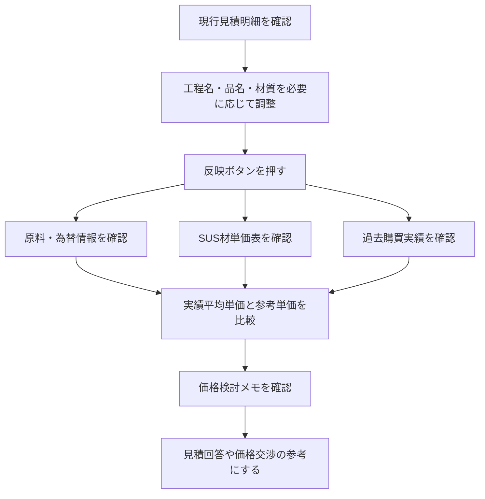
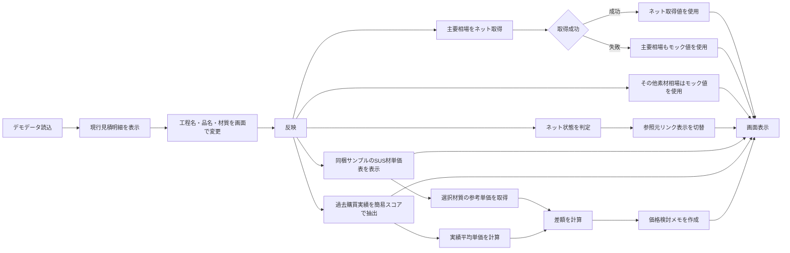
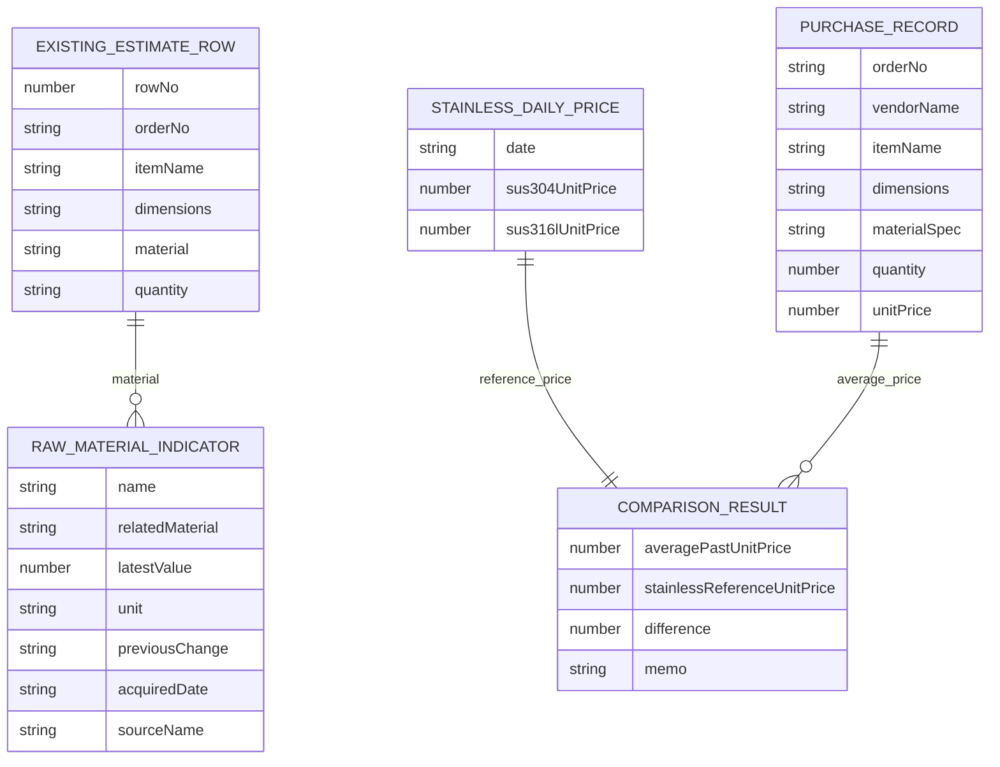

# 製品調達支援デモ 説明資料

## 1. 資料の目的

本資料は、製品調達支援デモの目的、画面構成、処理の考え方、データ構造、本番化に向けた検討事項を説明するための資料である。

今回のデモは、ネット接続の有無にかかわらず説明できる一画面の簡易デモである。ニッケル、クロム、モリブデン、為替レートはネット取得し、取得できない場合は同梱したモックデータで表示する。その他素材の参考相場は、見せ方確認用として常にモックデータで再現する。

## 2. 現状の課題

現状の価格検討では、発注担当者が複数の情報を手作業で確認し、Excelなどへ転記している。

| 課題 | 内容 | 影響 |
| --- | --- | --- |
| 原料・為替情報の確認が手作業 | 複数の相場情報を個別に確認する | 確認に時間がかかる |
| Excel転記が必要 | 確認した値を別資料へ入力する | 転記漏れ、入力ミスが起きやすい |
| 過去実績との比較が分散 | 購買管理データや過去見積を別途参照する | 判断材料をそろえるまで時間がかかる |
| 説明材料が属人化 | 価格検討の根拠が担当者の手元資料に残りやすい | 引き継ぎや確認がしづらい |

## 3. 今回の改善対象

今回の主な改善対象は、次の作業である。

> インターネットから原料価格、為替レートなどの相場情報を手作業で確認している作業の削減

デモ画面では、ニッケル、クロム、モリブデン、為替レートをネット取得し、その他素材の参考情報と同じ表で確認できるようにする。取得日は、取得元データの日付ではなく、画面で相場情報を取得・表示した日付として表示する。ネット不通、取得元エラー、タイムアウトの場合は、主要相場もモックデータで表示する。

## 4. 今回のデモの位置付け

今回のデモは、本番機能の詳細設計ではなく、業務改善の見せ方を確認するための簡易デモである。

| 項目 | 今回のデモ | 本番化時の想定 |
| --- | --- | --- |
| 実行環境 | ローカルPCで確認 | 社内環境、または管理されたWeb環境 |
| 画面 | 一画面 | 業務フローに合わせて画面分割を検討 |
| 主要相場 | ニッケル、クロム、モリブデン、為替をネット取得。失敗時はモック表示 | 取得元、利用条件、更新頻度の管理 |
| その他素材相場 | 材質に応じた参考情報として常にモック表示 | マスタ管理、手動更新、または必要に応じた取得方式を検討 |
| 購買実績 | TypeScriptのサンプルデータ | 購買管理システム、CSV、DBなど |
| DB | 使用しない | 必要に応じて設計 |
| 外部データ取得 | 主要相場に限定して実施 | 対象拡大時は契約や利用条件を確認 |
| RSS | 使用しない | 今回はRSS取得処理を作らない |
| AI連携 | 使用しない | 必要性と運用ルールを別途検討 |
| ネット未接続 | 主要相場もモックデータで表示継続 | 製品版はネット接続を前提に、取得失敗時の扱いを整理 |

## 5. 改善後の業務イメージ

改善後は、発注担当者が見積作成画面上の明細を確認し、必要に応じて材質や品名を調整したうえで、反映操作により参考情報をまとめて確認する。



## 6. デモ画面の構成

画面は、現行見積作成画面のイメージを上部に置き、その下に参考情報を表示する構成である。

| エリア | 役割 | 主な表示内容 |
| --- | --- | --- |
| ヘッダー | デモ画面の識別 | 製品調達支援デモ、ローカルデモ |
| 現行見積作成画面イメージ | 既存業務に近い見た目で明細を確認 | 見積依頼先、依頼条件、検査区分、明細表 |
| 反映操作 | 下部情報の表示開始 | 反映ボタン |
| デバッグ情報 | デモ中の処理状態確認 | 反映状態、読込データ件数、通信状態 |
| 原料・為替情報 | 相場情報の確認 | ニッケル、クロム、モリブデン、為替、材質別相場 |
| 比較結果 | 価格検討の要点確認 | 実績平均単価、同梱サンプルをもとにしたSUS材参考単価、前日比、差額、メモ |
| SUS材単価表 | 直近推移の確認 | SUS304、SUS316Lの直近3日の参考単価。単価は同梱サンプルを使用し、日付は表示日の前日から3日分に差し替え |
| 実績表 | 過去購買実績の確認 | 引用注番、品名、寸法、材質、業者名、実績単価 |

## 7. 今回デモでできること

| できること | 内容 |
| --- | --- |
| 既存見積明細の表示 | サンプルの見積明細を現行画面風に表示する |
| 明細セルの一部変更 | 工程名、品名、材質を画面上で変更する |
| 行選択の確認 | データ引継チェックで対象行の選択イメージを確認する |
| 反映操作 | 反映ボタンで下部の参考情報を表示する |
| 相場情報の表示 | ネット取得した主要相場と、その他素材の参考相場を表示する |
| SUS材単価表の表示 | SUS304、SUS316Lの直近3日分を表示する |
| 過去実績の抽出表示 | サンプル購買実績から近い実績を最大3件表示する |
| 比較結果の表示 | 実績平均単価、参考単価、差額、価格検討メモを表示する |
| オフライン表示確認 | ネット未接続時は主要相場もモックデータで表示を継続する |

## 8. 今回デモでやらないこと

| やらないこと | 理由 |
| --- | --- |
| その他素材の外部取得 | 今回は見せ方確認を優先し、常にモックデータで表示するため |
| DB保存 | デモでは永続化を行わないため |
| RSS取得 | 今回はRSS取得処理を作らないため |
| PDF解析 | 今回の対象は相場確認作業の削減であるため |
| 認証・権限管理 | 今回の説明範囲では対象外とするため |
| 正式な価格決定 | 表示結果は価格検討の参考情報であり、確定価格ではないため |

## 9. SUS材と原価要素の考え方

SUSは、ニッケルやクロムそのものではなく、鉄を主成分としたステンレス鋼の種類である。代表的なSUS304やSUS316Lは、鉄をベースに、クロム、ニッケル、モリブデンなどの合金元素を加えることで、耐食性や加工性などの性質を持たせている。

そのため、SUS材の価格を見る際は、ニッケルやクロムの価格だけでなく、鉄・ベース材、為替、加工費、流通費、業者別条件、数量条件、市況補正を含めて考える必要がある。

| 原価要素 | 価格への関係 | 補足 |
| --- | --- | --- |
| ニッケル価格 | SUS304、SUS316Lの価格に影響しやすい | 耐食性や靭性に関係する主要合金元素 |
| クロム価格 | ステンレス鋼全般に影響する | 耐食性を支える重要な合金元素 |
| モリブデン価格 | 特にSUS316L系に影響しやすい | 耐食性を高める要素として扱う |
| 為替レート | 輸入原料や国際相場を円換算する際に影響する | 円安時は円建て価格が上がりやすい |
| 鉄・ベース材価格 | SUSの土台となる材料価格に影響する | SUSは鉄を主成分とするため無視できない |
| 加工費 | 切断、曲げ、溶接、熱処理、検査などに影響する | 製品形状や加工内容により変わる |
| 流通費 | 輸送、在庫、商社マージンなどに影響する | 調達ルートにより差が出る |
| 業者別条件 | 取引実績、得意加工、支払条件などに影響する | 同じ材質でも業者により価格差が出る |
| 数量条件 | ロット、歩留まり、段取り費の配賦に影響する | 少量品は単価が高くなりやすい |
| 市況補正 | 需給、納期、急騰・急落時の補正に影響する | 定期見直しや時点差の確認が必要 |

## 10. 参考単価の簡易計算ロジック

本番化時には、原料価格、為替、ベース材、加工費、流通費などを組み合わせた計算式を検討する必要がある。一方、現行デモ実装では、SUS材単価表と比較結果の参考単価は同梱サンプルデータを使用する。ニッケル、クロム、モリブデン、為替レートは相場情報として表示するが、ネット取得した相場値をSUS材単価の計算へは反映しない。

### 10.1 デモ上の参考単価

| 処理 | デモでの扱い |
| --- | --- |
| 主要相場 | ニッケル、クロム、モリブデン、為替をネット取得し、失敗時はモック表示する |
| その他素材相場 | 材質に応じた参考情報として常にモック表示する |
| SUS材単価 | `sample/stainless-market.ts` のサンプル単価を使用し、日付は表示日の前日から3日分に差し替える |
| 参考単価 | 選択材質に応じて、表示日前日のSUS304またはSUS316L単価を取得する |
| 実績平均単価 | 抽出された過去購買実績の実績単価を平均する |
| 差額 | SUS材参考単価から実績平均単価を差し引く |
| 価格検討メモ | 差額率に応じて確認観点を文章化する |

### 10.2 本番化時に検討する式のイメージ

```text
SUS材参考単価 =
  鉄・ベース材価格
  + ニッケル価格影響
  + クロム価格影響
  + モリブデン価格影響
  + 為替換算影響
  + 加工費
  + 流通費
  + 業者別条件
  + 数量条件
  + 市況補正
```

今回のデモでは、この正式な内訳計算までは行わず、同梱サンプルのSUS材単価を参考単価として表示している。

## 11. 処理フロー

デモの処理は、デモデータを読み込み、画面上の反映操作をきっかけに各表示データを組み立てる流れである。ネット接続時は主要相場を取得し、取得できない場合は該当項目をモックデータで表示する。その他素材の参考相場は常にモックデータを使用する。



## 12. コード構成

| ファイル | 役割 |
| --- | --- |
| `src/app/page.tsx` | デモデータを読み込み、デモ画面へ渡す入口 |
| `src/app/api/market-indicators/route.ts` | ニッケル、クロム、モリブデン、為替レートをネット取得し、失敗時はモックへ戻す |
| `src/features/procurement/ProcurementDemo.tsx` | 一画面デモの状態管理と各表示エリアの組み立て |
| `src/features/procurement/components/ExistingEstimateView.tsx` | 現行見積作成画面イメージと明細表 |
| `src/features/procurement/components/MarketSection.tsx` | 原料・為替情報の表示 |
| `src/features/procurement/components/ComparisonSection.tsx` | 実績平均単価、参考単価、差額、メモの表示 |
| `src/features/procurement/components/StainlessPriceTable.tsx` | SUS材単価表の表示 |
| `src/features/procurement/components/SelectedRecordsTable.tsx` | 過去購買実績の表示 |
| `src/features/procurement/procurement-calculations.ts` | 単価取得、前日比、実績抽出スコア、平均単価、メモ作成 |
| `src/features/procurement/material-market-indicators.ts` | 見積明細の材質に応じた相場情報の組み立て |
| `src/features/procurement/existing-estimate-table.ts` | 現行見積表の列定義、列幅、価格欄の簡易計算 |
| `src/types/procurement.ts` | デモで利用する共通型定義 |
| `sample/*.ts` | デモ用のデータ |

### 12.1 指定処理名と現行実装の対応

下表の処理名は、説明資料上の役割を分かりやすく示すための名称である。現行コードでは、一部は同名の独立関数ではなく、近い役割の関数や `useMemo` 内の処理として実装している。

| 説明上の処理名 | 現行コード上の対応 | 役割 |
| --- | --- | --- |
| `fetchMarketMockData()` | `src/app/api/market-indicators/route.ts`、`buildDisplayedMarketIndicators()` | 主要相場はネット取得し、取得できない場合はモックデータへ戻す。その他素材の参考相場はモックデータを画面用に準備する |
| `calculateSusReferencePrice()` | `getStainlessUnitPrice()` | 表示日前日のSUS材単価から、選択材質に応じた参考単価を取り出す |
| `filterPastResultsByMaterial()` | `calculateSelectionScore()` と `selectedRecords` の抽出処理 | 過去購買実績から、材質、品名、寸法、数量、業者、キーワードが近い実績を選ぶ |
| `createPriceReviewMemo()` | `buildPriceMemo()` | 実績平均単価とSUS材参考単価の差をもとに、確認観点を文章化する |

## 13. データ構造

主要データの関係は次のとおりである。



| 型 | 主な用途 | 主な項目 |
| --- | --- | --- |
| `ExistingEstimateRow` | 現行見積明細 | 注文番号、工程名、品名、寸法、材質、数量、要求納期 |
| `RawMaterialIndicator` | 原料・為替情報 | 項目名、対象材質、最新値、単位、前回比、取得日、参照元 |
| `StainlessDailyPrice` | SUS材参考単価 | 対象期間、SUS304単価、SUS316L単価 |
| `PurchaseRecord` | 過去購買実績 | 注番、業者名、品名、寸法、材質、数量、実績単価 |
| `SelectedPurchaseRecord` | 抽出後の購買実績 | 過去購買実績、一致項目、スコア |
| `ComparisonResult` | 比較結果 | 実績平均単価、SUS材参考単価、差額、価格検討メモ |

## 14. 本番化に向けた検討事項

| 検討事項 | 確認内容 |
| --- | --- |
| 相場情報の取得元 | 主要相場およびその他素材について、取得元、利用条件、更新頻度を確認する |
| データ取得方式 | API、CSV、契約データ、手動取込など、安定した方法を検討する |
| 取得失敗時の扱い | 前回値表示、取得日時表示、担当者への通知方法を決める |
| SUS材単価ロジック | 原料価格、為替、ベース材、加工費、流通費、市況補正の計算式を定義する |
| 購買実績連携 | 購買管理システム、CSV、DBなど、実績データの取得方法を決める |
| マスタ管理 | 材質、業者、単位、係数、参照元URLなどの管理方法を決める |
| 権限管理 | 閲覧、更新、承認などの権限を整理する |
| 監査ログ | 取得値、参照日時、表示結果、更新履歴を残すか検討する |
| 画面導線 | 既存見積作成画面へ組み込むか、別画面にするかを検討する |
| 価格表現 | 参考値、見積値、確定値の区別が誤解なく伝わる表示にする |
| オフライン時の扱い | 製品版ではネット接続を前提としつつ、取得失敗時にどのデータを代替表示するか整理する |
| 保守運用 | 参照元変更、係数見直し、サンプル・マスタ更新の運用を決める |

以上の検討を進めることで、今回のデモを、実際の調達業務で使いやすい支援画面へ拡張できる。
